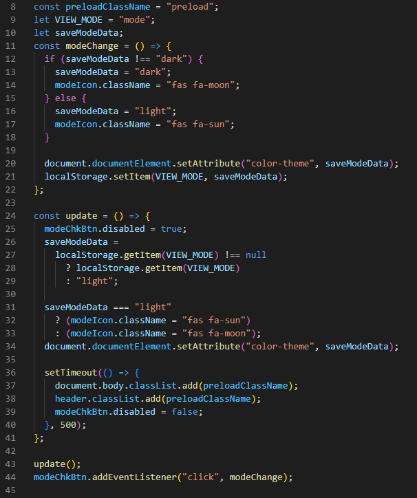
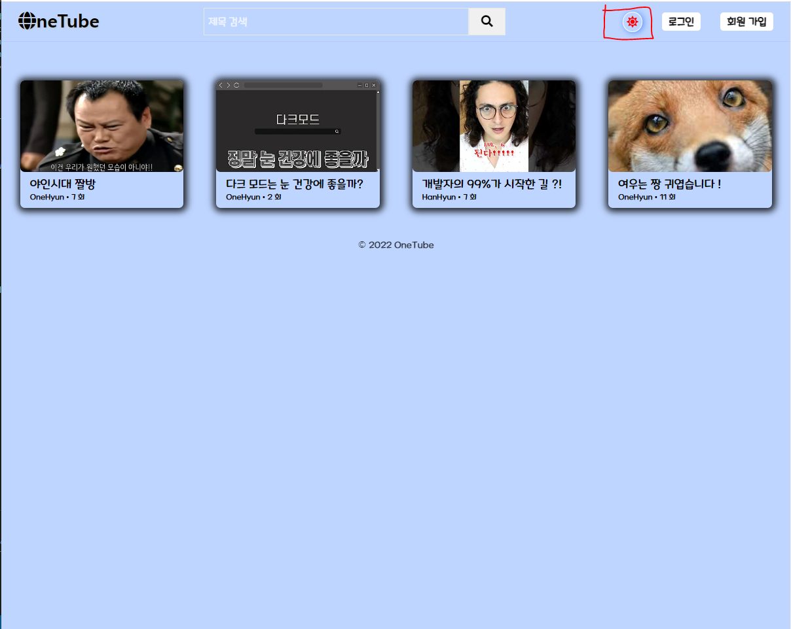
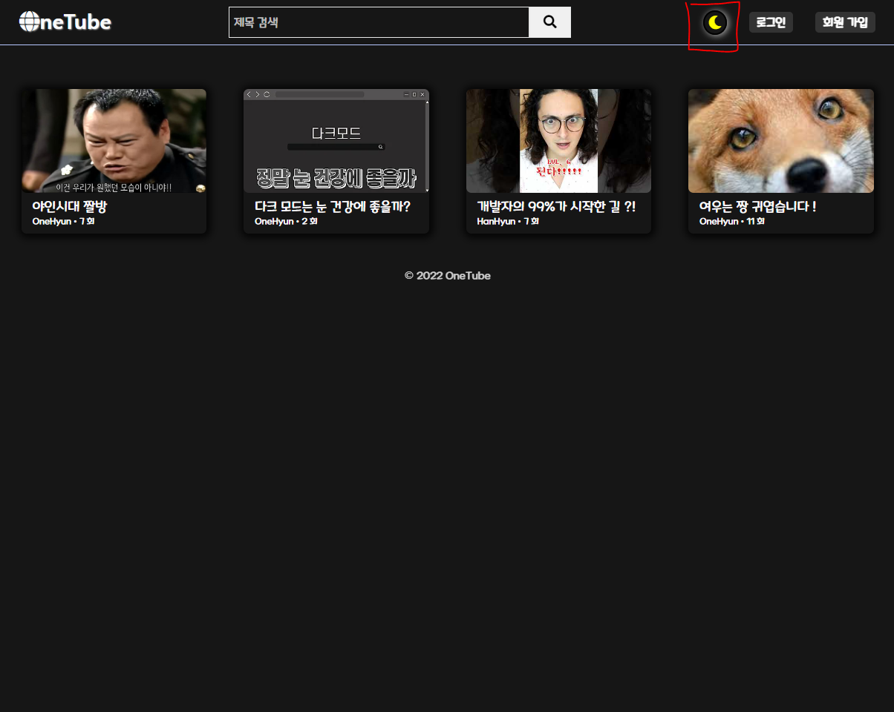
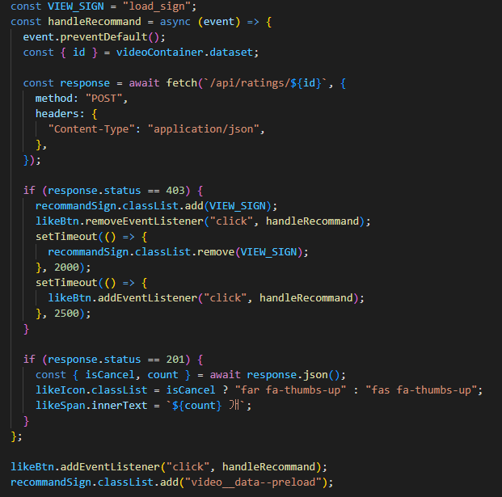
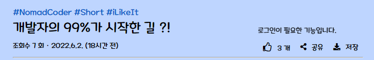
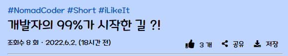
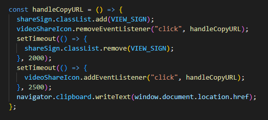
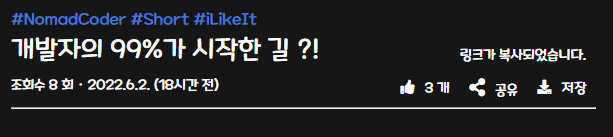

## ⭐️ 원튜브 (유튜브 클론) 회고

- [사용 기술](#사용-기술)

- [추가적인 기능](#추가적인-기능-트러블-슈팅)

- [배포](#배포)

---

### 프로젝트 시작

프론트엔드로 방향성을 잡은 후, 시작한 첫 프로젝트? 라고 하고 싶지만, 따라하는 것으로 시작한 챌린지라 생각하는게 맞을 것 같습니다.

이 프로젝트를 왜 시작했는지 ? 처음 접하였을 때, 풀스택이라는 말에 혹하여 시작하였고, 배움을 통해 마주한 새로운 기술, 문법 등은 언제나 우물 안 개구리 같다는 느낌과 함께 자극받은 경험이었던 것 같습니다.

또한, 완강을 한 후로, 새로운 프로젝트를 시작하기 전, 이것을 제 방식대로 완성을 해보고 싶다는 생각을 가진 것 같습니다.

주어진 템플릿을 뜯으며, 작동 원리를 재차 이해하고, 커스텀하고, 추가적으로 주로 사용하던 기능을 넣어보면 어떨까 하는 생각으로 넣어보고, 좋은 경험이라 판단하였기에 회고를 작성해보기 시작했습니다.

---

### 사용 기술

#### FrontEnd

#### BackEnd

#### DataBase

---

### 추가적인 기능 (트러블 슈팅)

완강 후, 없어서 아쉬움을 가져보던 기능들에 대해, 아쉬움 보다는 직접 만들어보면 어떨까? 하는 생각을 가져 보았고, 시작하게 되었습니다.

### 다크 모드

자주 사용하던 모드인 만큼, 이것을 직접적으로 적용해보자 하는 다짐과 함께 처음 만들어본 추가적 기능입니다.

#### Before, 구현 중 발생한 문제점은 ?

로컬 스토리지를 통해 html에 속성을 부여하는 방식으로 작업을 해보았으며, 이 과정에서 처음 html에 null인 속성이 로컬 스토리지의 값을 받기 때문에 새로고침 시, 또는 페이지 로딩 시, 설정해둔 트랜지션을 동작하는 경우가 발생했습니다.

#### After, 해당 문제를 해결한 방법은?

이 부분에 대한 고민은 js 파일이 호출될 때, 트랜지션 이벤트를 가진 preload 클래스를 부여함으로써, 페이지 로딩 시, 모든 설정 값이 부여된 후, 트랜지션 속성을 갖기에, 해당 문제가 발생하지 않도록 수정하였습니다.

#### 더 좋은 방법에 대한 고민

color-theme 라는 어트리뷰트를 set하여, 미디어 쿼리를 통해 적용을 하였던 만큼, 이슈를 고친 후로, 더 좋은 방법이 있지 않을까 생각한 것 같습니다.

그 때, prefers-color-scheme에 대한 개념을 알게 되었고, 이 방법은 렌더링 하는 문서와 관계 없이, 디스플레이의 장치 값을 통해 미디어 쿼리를 적용하는 점에서 매번 렌더링 하는 문서에 속성을 넣어주는 것 보다, 상대적으로 이점이 있을 것 같다고 생각했습니다.

#### 적용 사진

---

### 좋아요 기능

기능을 구현하고자 한 의지만큼, 많은 시행 착오가 있었던 기능인 것 같습니다.

#### Before, 구현 중 발생한 문제점은 ?

설계 미스로, recommend 라는 모델을 만들고, 해당 모델 안에 owner와 video의 정보를 담는 방법과,

video 모델 속성 중 meta 에서 가진 rating 속성이 count와 user를 가지고, 또 user에서 owner 와 다른 추가적 데이터를 가지는 등 방법을 도전했었습니다.

이 과정에서 복잡하게 꼬여가는 구조로 오히려 스파게티 코드로 변질되어감과, 불러오려는 데이터를 제대로 불러오지 못하는 경우가 생겼습니다.

#### After, 해당 문제를 해결한 방법은?

위의 문제점을 겪으며, 한 가지의 속성은 한 가지의 일만 하도록 나누는 개념을 재차 떠올려 보았고,

video model -> meta -> rating 속성에서 user id 정보와 count 만을 가짐으로서, 해당 유저가 좋아요를 선택하였는지 확인 후, true/false의 경우에 따라, 페이지 로딩 시, 아이콘과 클릭 시, 카운트 체크에 대한 변화를 주었습니다.

#### 더 좋은 방법에 대한 고민

이 기능을 구현한 후, mongoDB를 활용한 좋아요/싫어요를 구현하기 위해 $not 연산자를 사용하는 것을 보았습니다.

또한, 유튜브 클론으로 시작한 프로젝트인 만큼, 유튜브의 기능을 분석해보았을 땐, like와 dislike 상태, removelike, removedislike 신호까지 하여 4가지 요청을 보내고 있었고,

그런 식으로 설계 했더라면, 싫어요 기능까지 제대로 구현을 해볼 수 있었을 것만 같아, 아쉬움도, 데이터베이스와 서버 연산에 대한 아쉬움도 남는 것 같습니다.

#### 적용 사진

---

### 공유 기능

배포를 시작한 직후, 이 링크를 매번 주소창에서 복사/붙여넣기 하는 점은 공유라는 버튼에 적용을 시켜보면 어떨까 라는 생각으로 시작한 기능입니다.

#### Before, 구현 중 발생한 문제점은 ?

처음 이 기능을 작성할 때, 작업은 execCommand 메소드에서 copy 이벤트를 통해 클립 보드에 저장하는 방식을 사용하였습니다.

하지만, 더 이상 해당 메소드는 권장하지 않는다는 문서를 발견되었고, 이를 수정하였습니다.

#### After, 해당 문제를 해결한 방법은?

이러한 문제점을 대체하고자 나온 Clipboard Api를 활용하여, navigator.clipboard 메소드를 통해 권장 문서에 따른 방식으로 수정을 진행하였습니다.

해당 문제점을 수정한 후, 추가적으로 발견한 문서에서 Clipboard Api는 ios에 대한 버전을 13.4 버전 이상 부터 지원한다라는 문서를 보게 되었고,

이 때문에 작업을 끝마친 후로도, 모든 버전을 호환하기 위할 때, 권장 문서에 대해서는 어떻게 생각해야 하는지 고민을 하게 된 시간이었던 것 같습니다.

#### 적용 사진

---

### 배포

AWS s3를 통해, video와 avatar 등의 정보를 저장하도록 하고, heroku를 통해서 이 프로젝트의 마무리를 진행해보았습니다.

#### 왜 Heroku를 사용했는가 ?

강의에서 진행을 하였다는 점도 있지만, 가장 큰 이점은 사용하기 쉽다는 것이 와닿았던 것 같습니다.

또한 heroku 덕분에, aws 에서 직접적으로 관리할 필요가 없다는 것이 매력적이었습니다.

#### 배포 링크

https://onetube-w.herokuapp.com/

---
